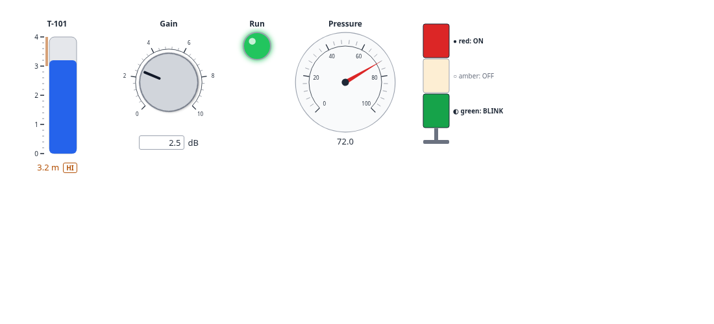

# AnywidgetInstruments.jl

[](https://github.com/AnywidgetInstruments/AnywidgetInstruments.jl/actions/workflows/CI.yml)
[](https://anywidgetinstruments.github.io/AnywidgetInstruments.jl/dev/)
[](https://github.com/JuliaTesting/Aqua.jl)

Instrumentation widgets for Julia: knobs, gauges, tanks, thermometers, LEDs,
switches, stack lights, strip charts, alarm lists, PID faceplates, state
machines… The widgets are the front end of the Python package
[anywidget-instruments-industrial](https://github.com/AnywidgetInstruments/anywidget-instruments-industrial),
shipped with this package together with their trait contract, and hosted by
[Anywidget.jl](https://github.com/AnywidgetInstruments/Anywidget.jl). No Python and no
Node.js are needed.

> **Status: pre-alpha (0.0.2, phase 1).** See the
> [specification](docs/src/specification.md) and the
> [roadmap](docs/src/roadmap.md).



## Install

```julia
using Pkg
Pkg.add(url = "https://github.com/AnywidgetInstruments/Anywidget.jl")   # until both are registered
Pkg.add(url = "https://github.com/AnywidgetInstruments/AnywidgetInstruments.jl")
```

Julia 1.10 (LTS) and later, tested on 1.13. The Kaimon Slate integration needs Julia 1.12 or later.

## Quick start

```julia
using AnywidgetInstruments

gain = Knob(2.5; min = 0, max = 10, step = 0.1, unit = "dB", label = "Gain")
level = Tank(1.2; max = 5, unit = "m", lo = 0.5, hi = 4.5, show_limits = true, label = "Level")
level[:value] = 2.0                  # checked against the trait contract
traits(level)                        # the dictionary a host binds the front end to

html_page("station.html", gain, level, LED(true; label = "Run"))
```

- **Every widget class** of anywidget-instruments-industrial has a constructor; unknown
  traits and invalid values throw an `ArgumentError`.
- **Standalone HTML**: widgets display in Documenter, VS Code, Jupyter
  (IJulia), Pluto or any HTML page.
- **[Kaimon Slate](https://github.com/kahliburke/KaimonSlate.jl)**: `@bind level Tank(...)`
  through Anywidget.jl and SlateAFM, with messages and binary buffers from Julia
  (`examples/kaimonslate/tank_station.jl`).
- **Shared rules** (alarm levels with deadband, value coercion, value labels)
  pass the parity cases of the Python and TypeScript implementations.

## Development

```bash
just test          # unit tests (TestItemRunner)
just test-slate    # Kaimon Slate extension tests (Julia ≥ 1.12)
just examples      # evaluate the example notebooks headless
just docs          # build the documentation, llms.txt and llms-full.txt
just sync-assets   # refresh the vendored front end from an anywidget-instruments-industrial wheel
```

## License

BSD 3-Clause, see [LICENSE](LICENSE). The front end in `assets/` comes from
[anywidget-instruments-industrial](https://github.com/AnywidgetInstruments/anywidget-instruments-industrial),
and `schema/instrument.schema.json` from the
[anywidget-instruments](https://github.com/AnywidgetInstruments/anywidget-instruments) core, under the same
license; their notices are in `assets/LICENSE-anywidget-instruments-industrial` and
`assets/LICENSE-anywidget-instruments`. The widgets are for monitoring,
teaching and prototyping; they are not a protection layer and never replace
the safety functions of a process.
